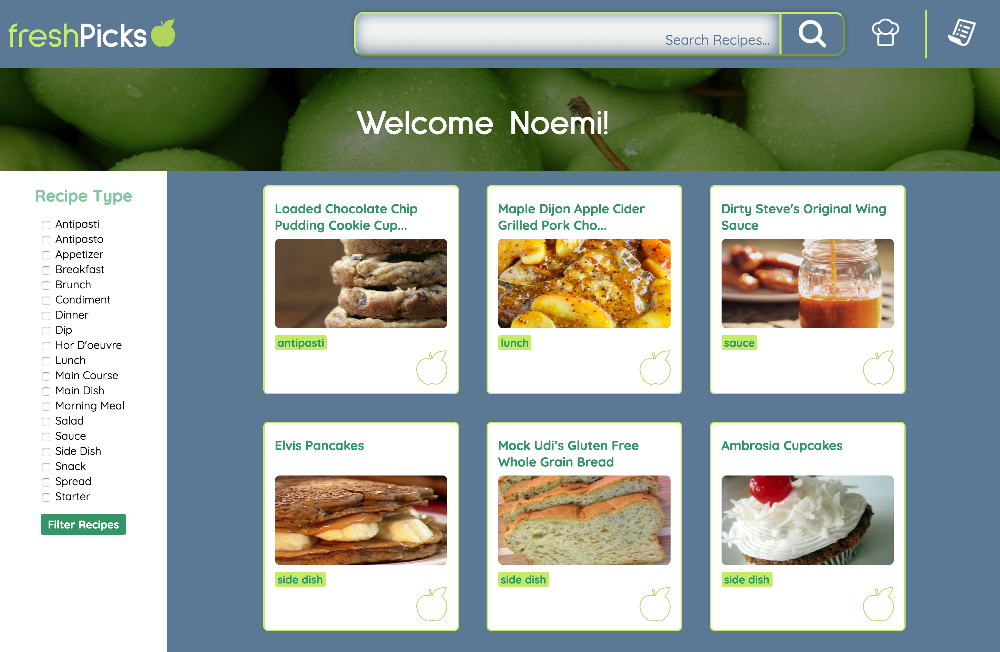
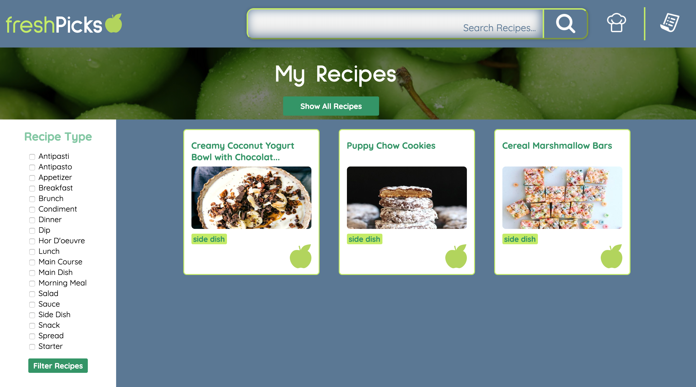
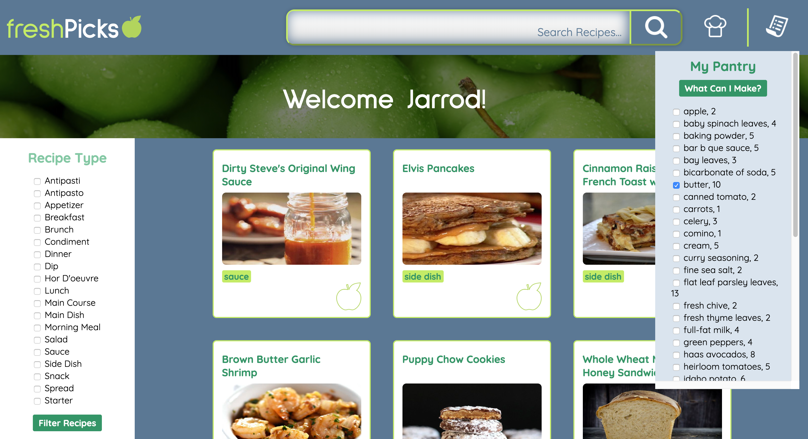

# Fresh Picks
Collaborators: Kyle Cornelissen & Carla Geglio

## Description
For our Mod 2 Pair Project, we created a recipe tracking application that allows users to view and favorite recipes. Users can also search for recipes by type, name, or ingredient. Finally, users can determine what recipes they could cook based on selected ingredients from their pantry.

## Set Up
1. Fork this repository and clone down.
2. Inside of the project directory, install the project dependencies by running npm install.
3. Run open src/index.html in the terminal to see the HTML page.

## Directions
1. Filter recipes by type: on the left sidebar, check the desired recipe types and then click "Filter."
2. Search for a recipe by name or ingredient: type the name of the recipe or ingredient into the searchbar at the top of the page and click the magnifying glass.
3. View a recipe: click on the recipe card to the recipe instructions and ingredients.
4. Favorite a recipe: click the apple icon on a recipe card and it will be saved to your favorite recipes. To view your favorite recipes, click the "My Recipes" button at the top right of the page.
5. View your pantry: click the "My Pantry" button at the top right of the page. To determine which recipes require a certain ingredient, check the box next to the ingredient and then click "What Can I Make?"

